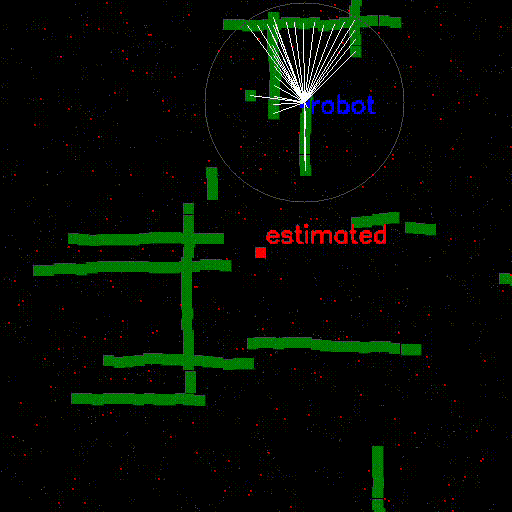

# visual based navigation
# LibsNavigation

## install

dependences : opencv, numpy, opengl (only for render)

```bash
pip3 install -e .
```

## particle filter localisation

* localication on known map
* input : dx, dy from odometry, observed distances

* filter [file link](LibsNavigator/libs_navigation/ParticleFilterLandmarks.py)

  


